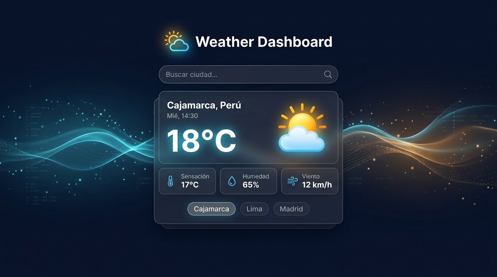

# Weather Dashboard — Aplicación Web Meteorológica

[](https://developer.mozilla.org/es/docs/Web/JavaScript)
[](https://developer.mozilla.org/es/docs/Web/HTML)
[](https://developer.mozilla.org/es/docs/Web/CSS)
[](LICENSE)
[](https://open-meteo.com/)

<p align="center">
  
</p>

> Aplicación web interactiva que permite consultar información meteorológica en tiempo real mediante el consumo asíncrono de una API externa, aplicando Programación Orientada a Objetos (POO), Promesas, async/await y manipulación dinámica del DOM.

---

## 📋 Descripción del Proyecto

**Weather Dashboard** es un proyecto integrador desarrollado con JavaScript Vanilla (ES6 Modules). La aplicación permite al usuario buscar ciudades, consultar temperatura actual, sensación térmica, humedad, velocidad del viento, condición meteorológica con iconografía representativa y mantener un historial interactivo con persistencia local.

### Conceptos Clave Implementados:
- **Arreglos**: Gestión inmutable y secuencial del historial de búsquedas sin duplicados.
- **Manipulación del DOM**: Creación y actualización dinámica de elementos sin datos estáticos en HTML.
- **Eventos**: Intercepción de formularios (`submit`), pulsación de tecla (`Enter`) y delegación de eventos en elementos dinámicos.
- **Promesas y async/await**: Consumo no bloqueante de la API con control de estados (`loading`, error 404, offline).
- **Programación Orientada a Objetos (POO)**: Clases con constructor, métodos, propiedades y encapsulamiento.

---

## 🏗️ Arquitectura y Estructura del Proyecto

```
dashboard-clima/
│
├── .github/
│   └── PULL_REQUEST_TEMPLATE.md # Plantilla formal obligatoria para Pull Requests
│
├── index.html                  # Estructura semántica HTML5
│
├── css/
│   └── styles.css              # Tokens de diseño (:root), layout responsive y componentes
│
├── js/
│   ├── models/
│   │   ├── Clima.js            # Clase Clima (Modelo POO)
│   │   └── Historial.js        # Clase Historial (Modelo POO)
│   │
│   ├── services/
│   │   └── WeatherService.js   # Consumo asíncrono API Open-Meteo
│   │
│   ├── ui/
│   │   └── DomRenderer.js      # Manipulación limpia del DOM
│   │
│   └── app.js                  # Orquestador principal y eventos
│
├── docs/                       # Sistema integral de documentación
│   ├── plan-implementacion.md  # Arquitectura técnica y plan de trabajo
│   ├── guia-desarrollo.md      # Convenciones, mapa de IDs y guía de sustentación
│   ├── backlog.md              # Backlog con 13 tareas ordenadas lógicamente
│   ├── diseno.md               # Propuesta de diseño UI/UX y sistema visual
│   └── workflow.md             # Flujo Git Flow, Conventional Commits y DoD
│
├── scripts/                    # Scripts de automatización (en .gitignore)
│   └── crear-issues.sh         # Creación automática de GitHub Issues
│
├── assets/                     # Recursos gráficos e iconografía
│   ├── favicon.svg             # Ícono de pestaña
│   ├── icons/                  # Íconos UI y condiciones meteorológicas WMO
│   └── img/                    # Logotipo, estado vacío y banner og-preview.png
│
├── package.json                # Metadatos del proyecto y scripts
├── .gitignore                  # Exclusiones de Git
├── LICENSE                     # Licencia MIT
└── README.md                   # Presentación del proyecto
```

---

## 🚀 Inicio Rápido

### Requisitos Previos
- Navegador web moderno (Chrome, Firefox, Edge, Safari) con soporte para ES6 Modules.
- Opcional: Extensión *Live Server* (VS Code) o servidor web estático local.

### Ejecución Local

1. **Clonar el repositorio**:
   ```bash
   git clone https://github.com/wigsdev/dashboard-clima.git
   cd dashboard-clima
   ```

2. **Abrir la aplicación**:
   Puedes abrir directamente `index.html` en tu navegador o usar un servidor local:
   ```bash
   # Opción 1: Con npm script
   npm start

   # Opción 2: Con Python
   python3 -m http.server 8080
   # Abrir en: http://localhost:8080
   ```

---

## 📸 Capturas de Pantalla

*(Esta sección se completará en la fase final del proyecto con las capturas de la interfaz en móvil, tablet y escritorio).*

---

## 📚 Documentación Técnica

El proyecto cuenta con un ecosistema documental exhaustivo que detalla cada aspecto técnico:

| Documento | Descripción |
|---|---|
| 📖 [Guía de Desarrollo](docs/guia-desarrollo.md) | Manual técnico: 17 secciones con mapa de IDs, clases, tabla WMO, métodos POO y guía de sustentación. |
| 📋 [Product Backlog](docs/backlog.md) | Desglose granular de 13 tareas con criterios de aceptación, DoD y mapa de dependencias. |
| 🎨 [Propuesta de Diseño UI/UX](docs/diseno.md) | Sistema visual con CSS Moderno (`clamp`, Range Queries), wireframes ASCII (desktop, tablet, móvil) y estados. |
| 🔄 [Workflow y Convenciones](docs/workflow.md) | Estándares de Git Flow, Conventional Commits con ejemplos y plantilla formal de Pull Request. |
| 🏛️ [Plan de Implementación](docs/plan-implementacion.md) | Arquitectura del sistema, justificación de Open-Meteo y roles de software. |
| 📜 [Historial de Cambios](CHANGELOG.md) | Registro de versiones bajo Semantic Versioning y Keep a Changelog. |

---

## 👥 Equipo de Desarrollo (Grupo 4)

| Rol | Integrante | GitHub |
|---|---|---|
| **Team Leader / Maintainer** | Wilmer | [@wigsdev](https://github.com/wigsdev) |
| **Developer** | Víctor Daniel Dávila Sánchez | [@danieldaviladev](https://github.com/danieldaviladev) |
| **Developer** | Javier Flores Encarnación | [@JavierFloresenc](https://github.com/JavierFloresenc) |
| **Developer** | Marco Chile | [@marcochile](https://github.com/marcochile) |
| **Developer** | Miriam H. | [@Miriamhha](https://github.com/Miriamhha) |

---

## 📄 Licencia

Este proyecto está distribuido bajo la Licencia MIT. Consulta el archivo [LICENSE](LICENSE) para más información.
