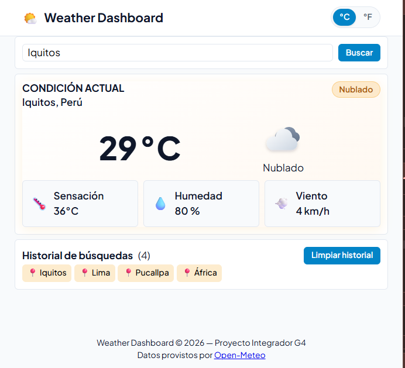
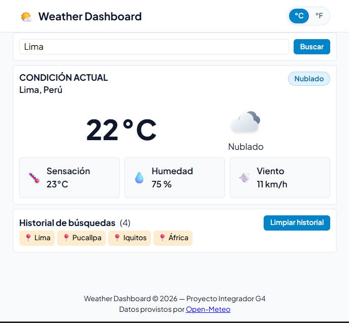
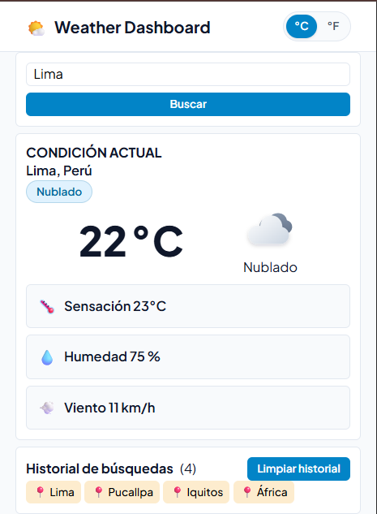

# Weather Dashboard — Aplicación Web Meteorológica

[](https://wigsdev.github.io/dashboard-clima/)
[](https://developer.mozilla.org/es/docs/Web/JavaScript)
[](https://developer.mozilla.org/es/docs/Web/HTML)
[](https://developer.mozilla.org/es/docs/Web/CSS)
[](LICENSE)
[](https://open-meteo.com/)

<p align="center">
  
</p>

> **Weather Dashboard** es una aplicación web interactiva que permite consultar el estado del clima en tiempo real mediante el consumo asíncrono de la API de Open-Meteo. Desarrollada con **JavaScript Vanilla (ES6 Modules)**, bajo principios de **Programación Orientada a Objetos (POO)** y un diseño moderno **100% responsivo**.

🔗 **Demo en Vivo:** [https://wigsdev.github.io/dashboard-clima/](https://wigsdev.github.io/dashboard-clima/)

---

## ✨ Características Principales

- 🔍 **Búsqueda Geocodificada Inteligente:** Consulta instantánea de ciudades globales mediante Open-Meteo Geocoding API.
- 🌡️ **Toggle de Unidades (°C / °F):** Conversión dinámica de temperatura y sensación térmica calculada mediante métodos POO.
- 🌓 **Ciclo Día / Noche e Iconografía Contextual:** Detección automática del estado diurno/nocturno con iconografía SVG dedicada.
- 📜 **Historial de Búsquedas Persistente:** Almacenamiento local (`localStorage`), límite estricto de 5 consultas recientes sin duplicados y re-consulta inmediata con un clic.
- 📴 **Detección Reactiva de Conexión:** Banner visual accesible que alerta al usuario cuando pierde la conexión a internet.
- ⚡ **Experiencia de Usuario Optimizada:** Estado de carga accesible (`aria-busy`), validación de entradas y manejo robusto de errores.

---

## 📱 Diseño Responsivo (Tablet & Móvil)

La interfaz se adapta fluidamente a cualquier dispositivo y resolución, ofreciendo controles táctiles ergonómicos y lectura clara de métricas meteorológicas:

| Vista Tablet | Vista Móvil |
|:---:|:---:|
|  |  |

---

## 🏗️ Arquitectura del Proyecto

El proyecto está diseñado bajo una arquitectura limpia con separación de responsabilidades en módulos ES6 nativos:

```
dashboard-clima/
├── index.html              # Estructura semántica HTML5 accesible (WAI-ARIA)
├── css/
│   └── styles.css          # Tokens de diseño (:root), layout responsive y componentes
├── js/
│   ├── models/             # Capa de Dominio (POO)
│   │   ├── Clima.js        # Modelo de clima, conversiones y lógica de íconos
│   │   └── Historial.js    # Gestión del historial y persistencia con localStorage
│   ├── services/           # Capa de Servicios
│   │   └── WeatherService.js # Consumo asíncrono de Open-Meteo (async/await)
│   ├── ui/                 # Capa de Presentación
│   │   └── DomRenderer.js  # Renderizado dinámico y actualización del DOM
│   └── app.js              # Controlador principal y gestión de eventos
├── assets/                 # Recursos gráficos, favicons e iconografía SVG
└── docs/                   # Documentación técnica, diseño y guías de desarrollo
```

---

## 🚀 Inicio Rápido

### Requisitos Previos
- Cualquier navegador web moderno con soporte para ES6 Modules.
- No requiere dependencias de producción ni herramientas de compilación.

### Ejecución Local

1. **Clonar el repositorio:**
   ```bash
   git clone https://github.com/wigsdev/dashboard-clima.git
   cd dashboard-clima
   ```

2. **Iniciar un servidor local:**
   Al utilizar módulos ES6 nativos, es necesario servir los archivos a través de un servidor HTTP local:
   ```bash
   # Opción 1: Con Python 3
   python3 -m http.server 8080

   # Opción 2: Con Node.js / npx
   npx serve .
   ```
   Abre [http://localhost:8080](http://localhost:8080) en tu navegador.

---

## 📚 Documentación

Para profundizar en los aspectos técnicos y organizacionales del proyecto, consulta las guías dedicadas en [`docs/`](docs/):

- 📋 [**Enunciado del Proyecto**](docs/Proyecto.md): Requisitos funcionales y alcance original.
- 📝 [**Guion de Presentación**](docs/diapositivas-presentacion.md): Estructura de diapositivas y exposición técnica.
- 📖 [**Guía Técnica de Desarrollo**](docs/guia-desarrollo.md): Arquitectura, componentes y mapeo de clases.
- 🎨 [**Propuesta de Diseño UI/UX**](docs/diseno.md): Tokens visuales, paleta de colores y wireframes.
- 🔄 [**Workflow y Convenciones**](docs/workflow.md): Estándares de Git Flow, Conventional Commits y DoD.
- 📜 [**Registro de Versiones**](CHANGELOG.md): Historial de versiones del proyecto.

---

## 👥 Equipo de Desarrollo (Grupo 4)

| Integrante | Rol | GitHub |
|---|---|---|
| **Wilmer Gulcochía Sánchez** | Team Leader & Maintainer | [@wigsdev](https://github.com/wigsdev) |
| **Víctor Daniel Dávila Sánchez** | Developer | [@danieldaviladev](https://github.com/danieldaviladev) |
| **Javier Flores Encarnación** | Developer | [@JavierFloresenc](https://github.com/JavierFloresenc) |
| **Marco Antonio Chile Andrade** | Developer | [@marcochile](https://github.com/marcochile) |
| **Miriam Hortencia Huamán Ayala** | Developer | [@Miriamhha](https://github.com/Miriamhha) |

---

## 📄 Licencia

Este proyecto está bajo la Licencia MIT. Consulta el archivo [LICENSE](LICENSE) para más información.
