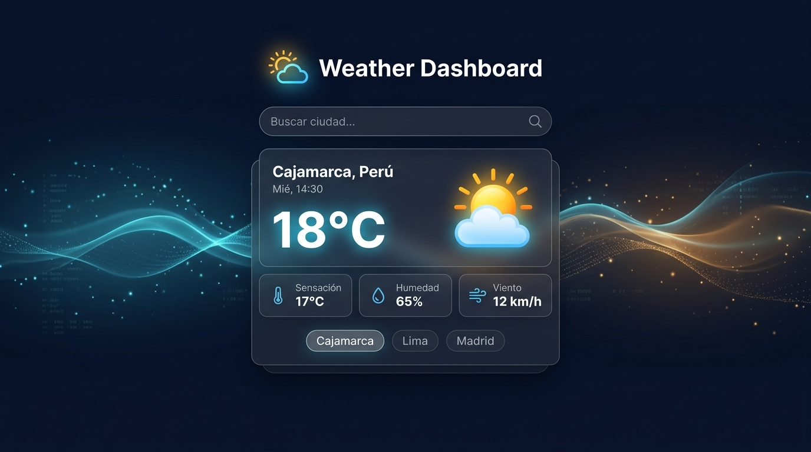

# Weather Dashboard — Aplicación Web Meteorológica

[](https://wigsdev.github.io/dashboard-clima/)
[](https://developer.mozilla.org/es/docs/Web/JavaScript)
[](https://developer.mozilla.org/es/docs/Web/HTML)
[](https://developer.mozilla.org/es/docs/Web/CSS)
[](LICENSE)
[](https://open-meteo.com/)

<p align="center">
  
</p>

> **Weather Dashboard** es una aplicación web interactiva que permite consultar información meteorológica en tiempo real mediante el consumo asíncrono de una API externa, implementada bajo una arquitectura limpia con **JavaScript Vanilla (ES6 Modules)**, **Programación Orientada a Objetos (POO)**, **Promesas / async-await**, **Manipulación dinámica del DOM** y un **diseño 100% responsivo**.

🔗 **Sitio en Producción:** [https://wigsdev.github.io/dashboard-clima/](https://wigsdev.github.io/dashboard-clima/)  
📊 **Diapositivas de Sustentación:** [docs/diapositivas-presentacion.html](docs/diapositivas-presentacion.html)

---

## 📸 Capturas de Pantalla de la Aplicación

La interfaz ha sido diseñada mobile-first y optimizada para brindar una experiencia fluida e intuitiva en cualquier resolución:

### 🖥️ Vista Escritorio (Desktop)
Diseño expandido en tarjeta central con métricas en 3 columnas y switch interactivo de temperatura (°C / °F):
<p align="center">
  
</p>

### 📱 Vistas Responsivas (Tablet y Móvil)
Adaptación fluida de controles, formulario y métricas apiladas ergonómicamente para interacción táctil:

| Vista Tablet | Vista Móvil |
|:---:|:---:|
|  |  |

---

## 🎯 Características Principales

- 🔍 **Búsqueda Geocodificada Inteligente:** Búsqueda en tiempo real de ciudades mundiales mediante Open-Meteo Geocoding API.
- 🌡️ **Toggle de Unidades (°C / °F):** Conversión dinámica de temperatura y sensación térmica al vuelo mediante métodos POO.
- 🎨 **Feedback Visual Dinámico:** Clases de temperatura contextuales (`card--warm` / `card--cold`) según el clima actual.
- 📜 **Historial de Búsquedas Persistente:** Almacenamiento local seguro (`localStorage`), límite de 5 elementos recientes sin duplicados y re-consulta inmediata con un clic.
- 📴 **Detección de Conexión (Offline/Online):** Banner reactivo que alerta inmediatamente al usuario si pierde conectividad.
- ⚡ **Estados de UI Claros:** Indicador de carga accesible (`aria-busy`), validación de entradas vacías y manejo de errores 404 / ciudad no encontrada.

---

## 🏛️ Sustentación Técnica — Los 5 Pilares del Proyecto

| Pilar Requerido | Implementación en el Proyecto | Ubicación en el Código |
|---|---|---|
| **1. Arreglos (`Array`)** | Gestión secuencial del historial de búsquedas. Se aplican métodos funcionales inmutables (`filter`, `slice`, `map`, `forEach`), deduplicación por nombre normalizado y límite estricto de 5 elementos. | [js/models/Historial.js](js/models/Historial.js) |
| **2. Manipulación del DOM** | Renderizado 100% dinámico sin datos "quemados" en HTML. Inyección de plantillas con sanitización básica, actualización de atributos ARIA y alternancia de clases de estado (`hidden`, `card--warm`, `card--cold`). | [js/ui/DomRenderer.js](js/ui/DomRenderer.js) |
| **3. Manejo de Eventos** | Captura del evento `submit` del formulario (con `preventDefault`), teclado (`Enter`), delegación de eventos en historial (`click`), click en limpiar historial, toggle de unidades y eventos globales de red (`online`/`offline`). | [js/app.js](js/app.js) |
| **4. Promesas y async/await** | Flujo asíncrono no bloqueante con `fetch`. Pipeline de dos fases (Geocoding ➔ Weather Forecast) con control de errores por red, HTTP status no 200 y validación de resultados vacíos. | [js/services/WeatherService.js](js/services/WeatherService.js) |
| **5. Programación Orientada a Objetos** | Clases de dominio `Clima` e `Historial` con constructores, encapsulamiento, métodos de instancia (`toFahrenheit()`, `getIconPath()`, `agregarCiudad()`, `guardarEnStorage()`). | [js/models/Clima.js](js/models/Clima.js)<br>[js/models/Historial.js](js/models/Historial.js) |

---

## 🏗️ Arquitectura y Estructura del Repositorio

```
dashboard-clima/
│
├── .github/
│   └── PULL_REQUEST_TEMPLATE.md   # Plantilla formal obligatoria para Pull Requests
│
├── index.html                    # Estructura semántica HTML5 accesible (WAI-ARIA)
│
├── css/
│   └── styles.css                # Tokens de diseño (:root), layout responsive y componentes
│
├── js/
│   ├── models/
│   │   ├── Clima.js              # Clase Clima (Modelo de Dominio POO)
│   │   └── Historial.js          # Clase Historial (Modelo POO + localStorage)
│   │
│   ├── services/
│   │   └── WeatherService.js     # Consumo asíncrono API Open-Meteo (async/await)
│   │
│   ├── ui/
│   │   └── DomRenderer.js        # Manipulación y renderizado limpio del DOM
│   │
│   └── app.js                    # Orquestador principal y gestión de eventos
│
├── docs/                         # Sistema integral de documentación
│   ├── Proyecto.md               # Enunciado oficial y rúbrica del Proyecto Integrador
│   ├── sustentacion-seccion-15.md     # Respuestas técnicas rigurosas a los 7 puntos de la Sección 15
│   ├── diapositivas-presentacion.html # Diapositivas interactivas listas para sustentación (23 slides)
│   ├── diapositivas-presentacion.md   # Guion completo de la presentación (23 diapositivas)
│   ├── plan-implementacion.md    # Arquitectura técnica y plan de trabajo
│   ├── guia-desarrollo.md        # Manual técnico y guía de sustentación de 17 secciones
│   ├── backlog.md                # Backlog con 13 tareas ordenadas y DoD
│   ├── diseno.md                 # Propuesta de diseño UI/UX y sistema visual
│   └── workflow.md               # Flujo Git Flow, Conventional Commits y DoD
│
├── assets/                       # Recursos gráficos e iconografía
│   ├── favicon.svg               # Ícono de pestaña
│   ├── icons/                    # Íconos UI y condiciones meteorológicas WMO
│   └── img/                      # Logotipo, estado vacío, banner y capturas (desktop, tablet, mobile)
│
├── package.json                  # Metadatos del proyecto y scripts
├── .gitignore                  # Exclusiones de Git
├── LICENSE                       # Licencia MIT
└── README.md                     # Presentación del proyecto
```

---

## 🚀 Inicio Rápido y Ejecución Local

### Requisitos Previos
- Cualquier navegador web moderno (Google Chrome, Mozilla Firefox, Microsoft Edge, Safari) con soporte para ES6 Modules.
- No requiere dependencias de producción, Node.js ni bundlers externos.

### Ejecución Local

1. **Clonar el repositorio**:
   ```bash
   git clone https://github.com/wigsdev/dashboard-clima.git
   cd dashboard-clima
   ```

2. **Iniciar servidor local**:
   Al usar ES6 Modules (`import`/`export`), se recomienda servir el proyecto mediante un servidor web local:
   ```bash
   # Opción 1: Con npm (usando live-server o serve si está instalado)
   npm start

   # Opción 2: Con Python 3
   python3 -m http.server 8080
   # Abrir en el navegador: http://localhost:8080

   # Opción 3: Con la extensión Live Server de VS Code (Clic derecho en index.html -> "Open with Live Server")
   ```

---

## 📚 Documentación Técnica Detallada

| Documento | Descripción |
|---|---|
| 📋 [Enunciado del Proyecto](docs/Proyecto.md) | Enunciado académico oficial, requisitos funcionales y criterios de evaluación del Proyecto Integrador. |
| 🎓 [Sustentación Técnica Oficial (Sección 15)](docs/sustentacion-seccion-15.md) | Guía exhaustiva y defensa académica de los 7 apartados obligatorios requeridos por la rúbrica docente. |
| 📊 [Presentación Web Interactiva](docs/diapositivas-presentacion.html) | Deck de 23 diapositivas interactivas con visor de código y navegación por teclado para la sustentación final. |
| 📝 [Guion de Diapositivas](docs/diapositivas-presentacion.md) | Documento markdown con el guion completo de 23 diapositivas y estrategia de exposición. |
| 📖 [Guía de Desarrollo y Sustentación](docs/guia-desarrollo.md) | Manual técnico exhaustivo: 17 secciones con mapa de IDs, clases, tabla WMO, métodos POO y banco de preguntas. |
| 📋 [Product Backlog](docs/backlog.md) | Desglose granular de 13 tareas (T-01 a T-13) con criterios de aceptación y dependencias. |
| 🎨 [Propuesta de Diseño UI/UX](docs/diseno.md) | Sistema visual con CSS Moderno (`clamp`, Range Queries), wireframes ASCII y estados de la UI. |
| 🔄 [Workflow y Convenciones](docs/workflow.md) | Estándares de Git Flow, Conventional Commits y plantilla formal de Pull Request. |
| 🏛️ [Plan de Implementación](docs/plan-implementacion.md) | Arquitectura del sistema, justificación técnica de Open-Meteo y roles de software. |
| 📜 [Historial de Cambios](CHANGELOG.md) | Registro de versiones bajo Semantic Versioning y Keep a Changelog. |

---

## 👥 Equipo de Desarrollo (Grupo 4)

| Integrante | Rol | GitHub |
|---|---|---|
| **Wilmer Gulcochía Sánchez** | Team Leader & Maintainer | [@wigsdev](https://github.com/wigsdev) |
| **Víctor Daniel Dávila Sánchez** | Developer | [@danieldaviladev](https://github.com/danieldaviladev) |
| **Javier Flores Encarnación** | Developer | [@JavierFloresenc](https://github.com/JavierFloresenc) |
| **Marco Antonio Chile Andrade** | Developer | [@marcochile](https://github.com/marcochile) |
| **Miriam Hortencia Huamán Ayala** | Developer | [@Miriamhha](https://github.com/Miriamhha) |

---

## 📄 Licencia

Este proyecto está bajo la Licencia MIT. Consulta el archivo [LICENSE](LICENSE) para más detalles.
